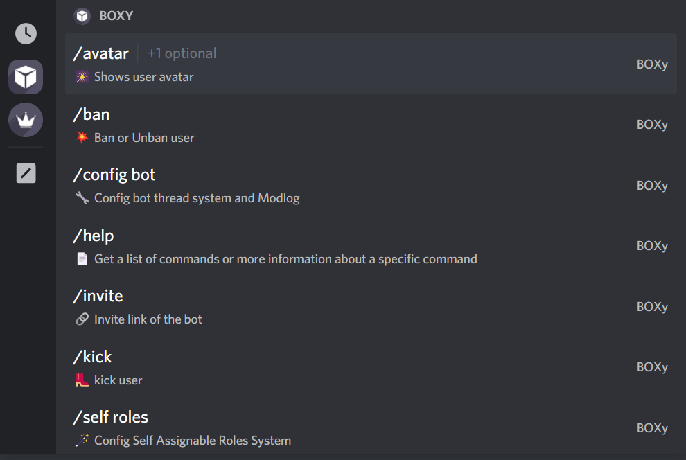

# Commands


**Good to know:** BOXy commands are all in slash command format, except for some moderation commands due to server security issues.


### Prefix

BOXy default prefix: `b.`,\
and also you can find all bot commands in `/` Slash Commands list&#x20;



### **Information commands:**

<details>

<summary>Avatar</summary>

**You can view the avatar and banner of either yourself or another user.**

To view your own avatar

```
/avatar 
```

To view another user's avatar

```
/avatar target:<mention user>
```

</details>

<details>

<summary><strong>User</strong></summary>

**You can view information about yourself or another user. This includes when the account was created, when the account joined the current server, what roles the account has in the current server, and more!**

To view your own user account information

```
/user
```

To view another user's account information

```
/user target:<mention user> 
```

</details>

<details>

<summary><strong>Server</strong></summary>

**You can view information about the current server. This includes the server name, who owns the server, when the server was created, and more!**

```
/server
```

</details>

<details>

<summary>stats</summary>

**You can request some statistics about BOXy. This includes how many servers BOXy is in, how much memory BOXy is using, top server list, and more!**

```
/stats
```

</details>

<details>

<summary>Invite</summary>

**You can view the bot invite link with this code**

```
/invite
```

</details>

